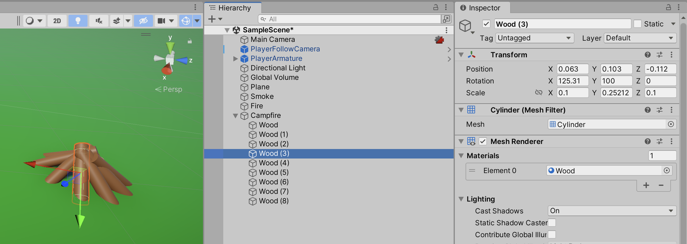
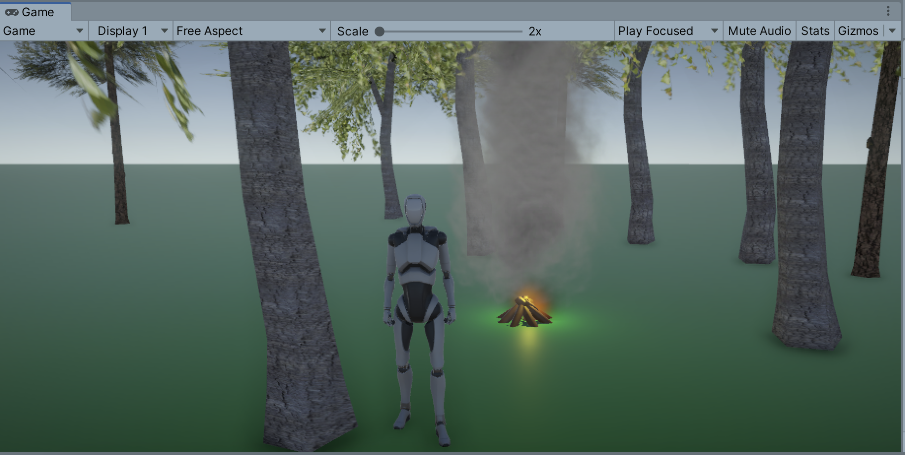

# unity-smoke-particle-system-urp

### Unity project with a very simple terrain

1. Create new Unity 3D URP project (can also be used with built-in/core renderer project)
1. Create a plane and paint it green (using a material)

### Simple smoke particle system

1. Create Effects -> Particle System
1. Set particle size, speed and color
   
1. Set emission
   
1. Set shape

Already by now, we have a simple working smoke effect

_Optional: [Install Starter Assets - Third Person Character Controller](https://assetstore.unity.com/packages/essentials/starter-assets-third-person-character-controller-196526), so we can easily walk around in scene (if URP project, use Edit -> Rendering -> Materials -> Convert... to convert materials for character to URP)_

Your scene could now look something like this:

### More realistic smoke using a texture material

1. Download the zip file containing all smoke textures from https://opengameart.org/content/smoke-aura
1. Copy the file `0000.png` into Unity project
1. Create a new material and name it "Smoke"
1. Use shader "Mobile/Particles/Alpha Blended" and set the smoke tecture image
   
1. Use the material in particle system
   
1. Since the texture images are darker, perhaps adjust the color a bit
1. Adjust "Size over lifetime" to make smoke smaller at the top
   

When going to playmode, should look something like the following:

Additionally you can configure the following settings for the particle system to make it look even more realistic:

* Noise (set Strength to somewhere between `0.1` and `0.25`)
* Color over lifetime, to make smoke brighter at top

The above steps are based on the Youtube video [How to Create SMOKE with Particles in Unity!](https://www.youtube.com/watch?v=YwGS73QpPt0), so you can watch that for more details.

### Making a simple campfire

1. Create cylinders to form a very simple campfire
   
2. Create a particle system with the following settings:
   - Start lifetime: 0.2
   - Start color: Yellow
   - Emission
     - Rate over time: 10
   - Shape
     - Shape: Cone
     - Angle: 10
     - Radius: 0.1
  - Color over lifetime
    - Dark orange to light orange
3. Adjust the original smoke particle system to be a bit smaller

Your campfire could now look something like this:

## Credits

Following assets are used in project:
* [Starter Assets - Third Person Character Controller](https://assetstore.unity.com/packages/essentials/starter-assets-third-person-character-controller-196526)
* [Mobile Tree Package](https://assetstore.unity.com/packages/3d/vegetation/trees/mobile-tree-package-18866)
